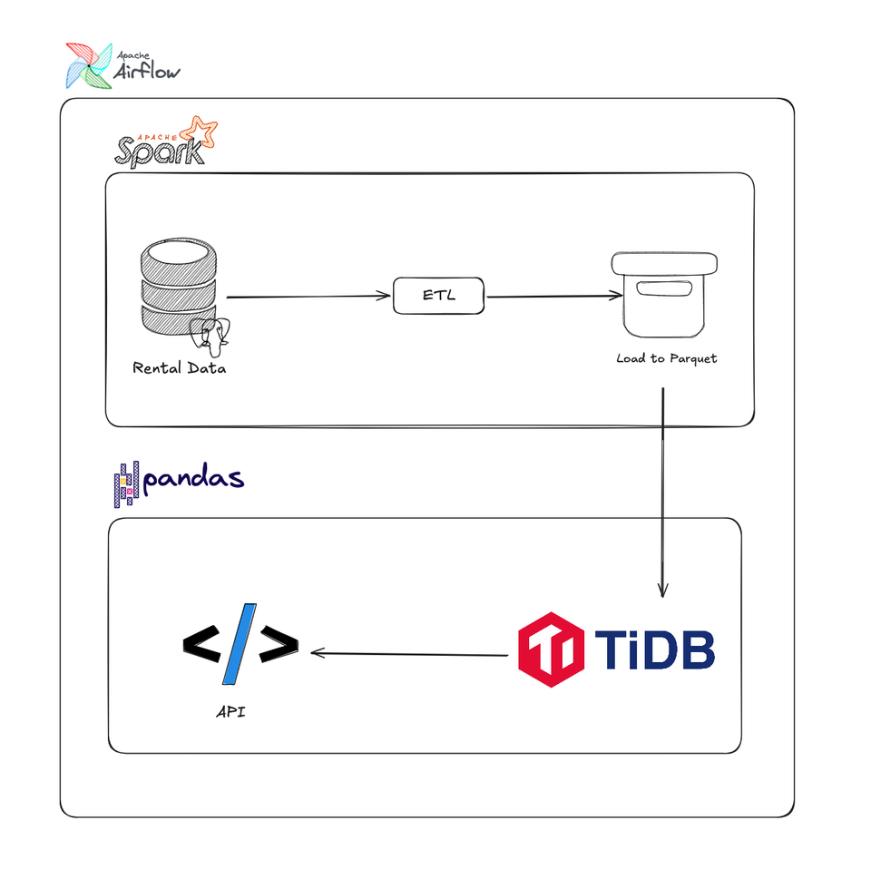

# Project 3 Batch Processing Using Airflow and Spark

Use case:
From product need help to integrate data from our dwh to their product via API:
- Top Country Based on User
- Total Film Based on Category

Prepare Tools:
- Airflow on Local
- VSCode
- Dbeaver
- Register postman
    - https://www.postman.com/
- Docker pull
    - `docker pull apache/airflow:2.10.0`
    - `docker pull postgres:13`
- Please clone this repo https://github.com/MSinggihP/airflow-docker and do step below:
    - `docker build -t my-airflow .`
    - `docker compose up -d`

Dataset:
https://www.kaggle.com/datasets/kapturovalexander/pagila-postgresql-sample-database

Flow:

 
Noted:
- What is TiDB?
TiDB is an open-source NewSQL database that supports Hybrid Transactional and Analytical Processing workloads.
Step by Step:
- Check connection DB server
    - Postgres
    - TiDB
- Run airflow on your local
    - Create file requirements.txt:
    - Build images, Dockerfile: `docker build -t my-airflow .`
- Create docker compose, docker-compose.yaml:

- Set connection on airflow
    - Postgres
    - TiDB
        - https://docs.pingcap.com/tidbcloud/secure-connections-to-serverless-clusters
- Extract:
    - Create module connector postgres
    - Create module get data from postgres
- Transform:
    - Create script for transformation data using spark
- Load
    - Create module connector for hadoop
- Create load data to hadoop

Result : 
https://ibb.co.com/7zQdHVg
